[**Pkgforge**](https://docs.pkgforge.dev/) has the [world's largest collection](https://docs.pkgforge.dev/soar/readme/packages#total) of [prebuilt](https://github.com/orgs/pkgforge/packages), [static binaries](https://docs.pkgforge.dev/repositories/bincache) that work everywhere without dependencies. Our [main repos](https://docs.pkgforge.dev/repositories) include hand-picked packages and manually maintained by us, but we had a crazy idea: what if we grabbed CLI tools from places like Rust's [crates.io](http://crates.io), built them as static binaries, and made them [available to everyone](https://github.com/pkgforge/soar)?

Basically, instead of manually adding every package, we'd tap into existing package ecosystems and automate the whole thing. It took us two weeks and a lot of trial & error to make this feasible.

---

# Ingesting Crates.io

Crates.io provides [api access](https://crates.io/api/openapi.json) for both per crate lookup or bulk lookup. Initially, our script iterated through the first 1000 pages (Sorted by downloads) with 100 crates per page. This worked for a while & we ended up with ~111,000 crates. But then we ran into a problem that we needed to query each of these crates individually again to determine if they were of category [`command-line-utilities`](https://crates.io/categories/command-line-utilities), or produced executables, i.e. contain [`[[bin]]`](https://doc.rust-lang.org/cargo/reference/cargo-targets.html#binaries) in their manifest. This was simply not practical as we started to run into rate limits & potentially also violated the [Usage Policy](https://crates.io/policies).

Fortunately, [RFC-3463](https://rust-lang.github.io/rfcs/3463-crates-io-policy-update.html#data-access) came to our rescue, as crates.io provides periodic database dumps at https://static.crates.io/db-dump.tar.gz . We quickly drafted a [nifty cli](https://github.com/pkgforge-cargo/builder/tree/main/tools/crates-dumper) using [dtolnay/db-dump](https://github.com/dtolnay/db-dump)


Then it was just a matter of parsing this with a bit of jq, & automating it via GitHub Actions. Our [workflow](https://github.com/pkgforge-cargo/builder/actions/workflows/gen_data.yaml) now generated [all the data](https://github.com/pkgforge-cargo/builder/tree/main/data) we will need, automatically.

---

# Crate Selection

Since we ended up with over 111,000 crates, we needed to set some constraints & filter only what we actually want to build:

1. Should either be of category [command-line-utilities](https://crates.io/categories/command-line-utilities): `categories = ["command-line-utilities"]`
    
2. Or must have a [`[[bin]]`](https://doc.rust-lang.org/cargo/reference/cargo-targets.html#binaries) section in the [Manifest](https://doc.rust-lang.org/cargo/reference/manifest.html).
    
3. Must be updated within the last year, i.e > `2024-01-01`
    

```bash
🦀 Total crates fetched:            ██████████████████████████████████████████████████ 111,722
     ↓
📦 Crates with binary targets:      ████████████████████████████████  24,658
     ↓
🔧 Crates with CLI category:        ██████████░░░░░░░░░░░░░░░░░░░░░░   8,451
     ↓
📆 Recently updated (2024+):        ███████████░░░░░░░░░░░░░░░░░░░░░  10,033
     ↓ + ↑
✅ Crates to Build: 10,033

// Total crates whose metadata was scraped/fetched: 111,722  
// Total crates with [[bin]] in their Cargo.toml manifest: 24,658  
// Total crates with command-line-utilities category in their Cargo.toml manifest: 8,451  
// After filtering for outdated crates (> date -d 'last year' '+%Y-01-01')  
// Total crates to build: 10,033
```

We ended up with ~ 10,000 crates that we now planned to compile.

---

# Build Constraints

Since we wanted truly portable, optimized & statically linked binaries, we applied the following build constraints:

```bash
#RUSTFLAGS
[+] Flags: -C target-feature=+crt-static \
           -C default-linker-libraries=yes \
           -C link-self-contained=yes \
           -C prefer-dynamic=no \
           -C embed-bitcode=yes \
           -C lto=yes \
           -C opt-level=3 \
           -C debuginfo=none \
           -C strip=symbols \
           -C link-arg=-Wl,-S \
           -C link-arg=-Wl,--build-id=none \
           -C link-arg=-Wl,--discard-all \
           -C link-arg=-Wl,--strip-all
```

1. [**Statically Linked**](https://rust-lang.github.io/rfcs/1721-crt-static.html): `-C target-feature=+crt-static`
    
2. [**Self Contained**](https://doc.rust-lang.org/beta/nightly-rustc/rustc_session/config/struct.LinkSelfContained.html): `-C link-self-contained=yes`
    
3. [**All Features**](https://doc.rust-lang.org/cargo/reference/features.html): `--all-features`
    
4. [**Link Time Optimization**](https://doc.rust-lang.org/cargo/reference/profiles.html#lto): `-C lto=yes`
    
5. [**All Optimizations**](https://doc.rust-lang.org/cargo/reference/profiles.html#opt-level): `-C opt-level=3`
    
6. [**Stripped**](https://doc.rust-lang.org/cargo/reference/profiles.html#strip): `-C debuginfo=none -C strip=symbols`
    
7. **No System Libraries**: Crates depending on system libraries will simply fail, as we primarily want pure rust crates.
    
    > ```bash
    > #These crates would error out in the following manner
    > error: could not find system library 'openssl' required by the 'openssl-sys' crate
    > error: Could not find system library 'sqlite3'
    > error: pkg-config has not been configured to support cross-compilation
    > ```
    

---

# Build Tool

Since we had over 10,000 crates that would be run as one crate per one GitHub actions runner, we wanted it to finish as quickly as possible. Cargo has [cross compilation features](https://rust-lang.github.io/rustup/cross-compilation.html), but it requires setup. So we were looking for something that just worked out of the box.

We also couldn’t use our [heavy docker images](https://github.com/pkgforge/devscripts/pkgs/container/devscripts%2Falpine-builder) that we use for our [official packages](https://github.com/search?q=repo%3Apkgforge%2Fsoarpkgs%20docker%20run&type=code), because pulling/extracting them alone consumed ~2-3 mins of CI. This left us with [rust-cross/cargo-zigbuild](https://github.com/rust-cross/cargo-zigbuild) & [cross-rs/cross](https://github.com/cross-rs/cross). After some local testing, we decided to use **Cross** as it supported all the targets we needed & worked as advertised: *“Zero setup” cross compilation*

We also used [jpeddicord/askalono](https://github.com/jpeddicord/askalono) to automatically detect & copy over licenses.

```bash
#The CMD Looks like
cross +nightly build --target "${RUST_TARGET}" -Z unstable-options \
     --all-features \
     --artifact-dir="${C_ARTIFACT_DIR}" \
     --jobs="$(($(nproc)+1))" \
     --release \
     --verbose
```

---

# Build Targets

While [**Soar**](https://github.com/pkgforge/soar) does run on any ***\*Unix-based Distro***, due to [lack of CI support for other Unix Kernel on GitHub Runners](https://github.com/actions/runner/issues/385) (natively, not VMs), we are limited to **Linux** only. We decided to cut the target matrix down further by skipping architectures that are reaching EOL, we ended up with:

| **HOST\_TRIPLET** | **RUST\_TARGET** |
| --- | --- |
| `aarch64-Linux` | `aarch64-unknown-linux-musl` |
| `loongarch64-Linux` | `loongarch64-unknown-linux-musl` |
| `riscv64-Linux` | `riscv64gc-unknown-linux-musl` |
| `x86_64-Linux` | `x86_64-unknown-linux-musl` |

---

# Build Security

We are aware of issues like [https://github.com/rust-lang/cargo/issues/13897](https://github.com/rust-lang/cargo/issues/13897), so we wanted this to be [as secure as our official repositories](https://docs.pkgforge.dev/repositories/soarpkgs/security), by ensuring:

* Crates are downloaded from [crates.io](https://crates.io/policies/security), like the official [Cargo](https://github.com/rust-lang/cargo) does.
    
* CI/CD run on [GitHub Actions](https://docs.github.com/en/actions/security-for-github-actions/security-guides/security-hardening-for-github-actions), with temporary/ephemeral tokens created & scoped to per package.
    
* Build Logs are viewable using: `soar log ${PKG_NAME}`
    
* Build Src is downloadable by downloading: [`{GHCR_PKG}-srcbuild-${BUILD_ID}`](https://github.com/orgs/pkgforge-cargo/packages?tab=packages&q=srcbuild)
    
* [Artifact Attestation](https://github.com/pkgforge-cargo/builder/attestations) & [Build Provenance](https://github.com/pkgforge-cargo/builder/attestations) are created/updated per build.
    
* Checksums are generated (& verified at install time by Soar) for each & every artifact per build.
    

The above measures ensured that even if a malicious crate decided to go rogue, it would not impact the integrity of any other crates & be limited to only itself.

---

# Build Workflow

10,000 multiplied by 4 targets, meant we would need to run ~ 40,000 instances of CI & also handle [metadata](https://github.com/pkgforge-cargo/builder/tree/metadata), [sanity checks](https://github.com/pkgforge-cargo/builder/blob/main/.github/workflows/matrix_builds.yaml), [uploading to ghcr](https://github.com/orgs/pkgforge-cargo/packages?repo_name=builder), all at the same time. We also set up a discord webhook to send this data over to our [discord server](https://discord.gg/djJUs48Zbu) so we see it live, in real time.

```mermaid
graph TD
  A[🦀 Crates.io API] -->|📊 Scrape Metadata 🧬| B[🔍 Filter & Queue ⏳]
  B --> C[🏗️ GitHub Actions Matrix 🔄]
  C --> D[⚙️ Cross Compiler ⚒️]
  D --> E[📦 Static Binaries 🛠️]
  E --> F[🗄️ GHCR Registry ⬆️]
  F -->|📊 Generate Metadata 🧬| B
  F --> G[🚀 Soar ⬇️]
```




---

# Takeaways

## Queued vs Built

As stated, we attempted to build ~ 10,000 crates with optimistic expectations. We did expect failures, but not as high as this:

```bash
🏗️ Build Pipeline by Success Rate
────────────────────────────────────────────────────────────────────────
✅ Queued    ████████████████████████████████████████    10,033 (100.0%)
⚙️ Built     ███████████████████████████                  5,779 (57.60%)
❌ Failed    ████████████                                 4,254 (42.40%)
────────────────────────────────────────────────────────────────────────
```

So what went wrong? We sampled about 100 of these error logs & concluded:

1. System library dependencies were responsible for the majority of the errors.
    
2. Some crates have custom-build system i.e. build.rs which fail if specified dependencies are not met.
    
    ```bash
    #These typically fail cross-compilation
    build.rs files that:
    - Detect system features
    - Link against system libraries
    - Generate code based on target environment
    ```
    

Despite years of Rust development, **system library dependencies remain the primary build failure cause**. This reinforces the value of targeting CLI tools that can be statically linked.

---

## Crates vs Executables

Another interesting insight from building at scale: many crates produce multiple executables. The ~ 5,800 crates we attempted generated ~ 21,000 individual executables (Also referred to as binaries or packages)

```bash
🏗️ Build Pipeline by Executables
──────────────────────────────────────────────────────────────────────────────────
📦 Crates Built       ██████████                                   5,779 (100.0%) #Base Line
⚙️ Total Executables  ████████████████████████████████████████     21,042 (364.0%)
──────────────────────────────────────────────────────────────────────────────────
```

This 3.6:1 ratio reveals how rich the Rust CLI ecosystem actually is.

---

## Native vs Cross

<div data-node-type="callout">
<div data-node-type="callout-emoji">ℹ</div>
<div data-node-type="callout-text">This counts the executables generated &amp; not individual crates. A single crate may generate multiple executables. (See Above)</div>
</div>

```bash
🏗️ Build Pipeline by Architecture
─────────────────────────────────────────────────────────────────────────────────
🖥️  x86_64-Linux     ████████████████████████████████████████     5,627 (100.00%) #Base Line
🖥️  aarch64-Linux    ███████████████████████████████████████▌     5,586 (99.30%)
🖥️  riscv64-Linux    ██████████████████████████████████████▎       5,370 (95.40%)
🖥️ loongarch64-Linux ███████████████████████████████▋              4,459 (79.20%)
─────────────────────────────────────────────────────────────────────────────────
```

The consistent success rates across architectures demonstrate Rust's excellent cross-platform story, though newer architectures like loongarch64 show slightly lower compatibility. Unfortunately, Architecture-specific code is still quite common, it seems numerous crates are written with x86\_64 assumptions.

For instance, if we try to list all executables (not crates) for `x86_64-Linux`, we only get 5,627. But total built crates are 5,779 so even if one crate produces one executable, we should at least see 5,779 executables.


What happened? Where did they go missing? Well it turns out, some crates actually build successfully for non-standard targets like `loongarch64-Linux` & `riscv64-Linux` but fail for the regular aarch64/x86\_64


The reason, as it turns out again, are build hooks/scripts that trigger for the standard targets but not for the others. You can see what crate built for what target here: [https://github.com/pkgforge-cargo/builder/blob/main/data/CRATES\_BUILT.json](https://github.com/pkgforge-cargo/builder/blob/main/data/CRATES_BUILT.json)

---

## CI Build Time

[matrix\_builds.yaml](https://github.com/pkgforge-cargo/builder/actions/workflows/.github/workflows/matrix_builds.yaml) is the main builder, others are for metadata & misc. This will significantly go down as we will only build crates that received an update & as well as implement caching.


Average build time was ~ 2 minutes.


---

# [**Review**](https://github.com/pkgforge-cargo/builder/actions/workflows/.github/workflows/matrix_builds.yaml)

## Quick Comparison

Compiling will always be slower than fetching prebuilds, as to how slow, it depends upon the crates & number of dependencies that Cargo has to compile before building the actual crate. In this demo, we will try to install [fd-find](https://github.com/sharkdp/fd), though you may use a crate with much more dependencies in your own tests.

We will also not measure the cpu, disk, memory & bandwidth used. Try it yourself and feel the difference.

### Cargo


```bash
$ time cargo install fd-find

real    0m51.893s
user    3m36.568s
sys     0m24.411s
```

### Cargo Binstall/Quick Install

[Cargo Binstall](https://github.com/cargo-bins/cargo-binstall) also uses [prebuilts](https://github.com/cargo-bins/cargo-quickinstall/), but takes time to resolve the crate first: [https://github.com/cargo-bins/cargo-binstall/issues/1333](https://github.com/cargo-bins/cargo-binstall/issues/1333)


```bash
$ time cargo binstall fd-find --no-confirm

real    0m6.001s
user    0m0.118s
sys     0m0.083s
```

[**Cargo-Binstall**](https://github.com/cargo-bins/cargo-binstall) and [**Cargo-Quickinstall**](https://github.com/cargo-bins/cargo-quickinstall/) are excellent tools that:

* Integrate with `cargo install` workflow
    
* Handle development dependencies and features
    
* Target developers who want faster `cargo install`
    

[**Soar**](https://github.com/pkgforge/soar) takes a different approach:

* **Distribution-focused**: Static executables for end users
    
* **No development integration**: Not meant for `cargo` workflows
    
* **Dependency-free**: Zero system library requirements
    
* **Cross-distribution**: Works on any \*nix system (MUSL/GLIBC)
    

### Soar


```bash
#Soar uses pkg_ids to ensure exact match because we have too many packages
$ time soar install "fd#pkgforge-cargo.fd-find.stable:pkgforge-cargo"

real    0m1.695s
user    0m0.062s
sys     0m0.090s
```

---

# Future Directions

The [pkgforge-cargo](https://github.com/pkgforge-cargo/builder/) project will likely see these additions/improvements in the near future:

* **Automated updates**: Rebuild crates when new versions are published (this is partially implemented)
    
* **Integration with Cargo**: Maybe something similar to what \`cargo binstall\` does.
    
* **Build optimization**: Further reduce binary sizes and CI Build times
    
* **Contribute Upstream**: Implement a system to create an issue on the GitHub repo of the maintainer, with build log attached if the build fails. This would be opt-in.
    
* **Community Feedback**: Listen to our users & the community to improve this project & hope for a [widespread adoption beyond Soar](https://docs.pkgforge.dev/repositories/soarpkgs/re-distribution).
    

As for us, @pkgforge team will try exploring other ecosystems & doing something similar.

---

# Conclusion

This project represents more than just a build farm; it's a proof of concept & also a reality check for the whole ecosystem. We would like to end this with these closing observations, thoughts & recommendations: