```mermaid
graph TD
  A[🦀 Crates.io API] -->|📊 Scrape Metadata 🧬| B[🔍 Filter & Queue ⏳]
  B --> C[🏗️ GitHub Actions Matrix 🔄]
  C --> D[⚙️ Cross Compiler ⚒️]
  D --> E[📦 Static Binaries 🛠️]
  E --> F[🗄️ GHCR Registry ⬆️]
  F -->|📊 Generate Metadata 🧬| B
  F --> G[🚀 Soar ⬇️]
```

<div data-node-type="callout">
<div data-node-type="callout-emoji">🤖</div>
<div data-node-type="callout-text">AI translation tools were used to assist with language clarity, as our research team are not native English speakers. We believe the quality of our research and findings will speak for themselves</div>
</div>

[**Pkgforge**](https://docs.pkgforge.dev/) hosts the [world's largest collection](https://docs.pkgforge.dev/soar/readme/packages#total) of [prebuilt](https://github.com/orgs/pkgforge/packages), [static binaries](https://docs.pkgforge.dev/repositories/bincache) that work everywhere without dependencies. While our [main repos](https://docs.pkgforge.dev/repositories) include hand-picked packages and manually maintained by our team, we had an ambitious idea: what if we could automatically harvest CLI tools from ecosystems like Rust's [crates.io](http://crates.io), build them as static binaries, and made them [available to everyone](https://github.com/pkgforge/soar)?

Instead of manually curating every package, we decided to tap into existing package ecosystems and automate the entire process. After two weeks of intensive development and countless iterations, we made this idea a reality.

---

# Ingesting Crates.io

Crates.io provides [api access](https://crates.io/api/openapi.json) for individual crate lookups and bulk operations. Initially, our script iterated through the first 1,000 pages (sorted by downloads) with 100 crates per page, yielding approximately 111,000 crates. However, we soon encountered a significant bottleneck: we needed to query each crate individually to determine if it belonged to the [`command-line-utilities`](https://crates.io/categories/command-line-utilities), or produced executables, i.e. contained [`[[bin]]`](https://doc.rust-lang.org/cargo/reference/cargo-targets.html#binaries) in their manifest.

This approach proved impractical as we quickly hit rate limits and potentially violated the [Usage Policy](https://crates.io/policies). Fortunately, [RFC-3463](https://rust-lang.github.io/rfcs/3463-crates-io-policy-update.html#data-access) came to our rescue. Crates.io provides periodic database dumps at https://static.crates.io/db-dump.tar.gz . We quickly drafted a [nifty cli](https://github.com/pkgforge-cargo/builder/tree/main/tools/crates-dumper) using [dtolnay/db-dump](https://github.com/dtolnay/db-dump)


Then it was just a matter of parsing this with a bit of jq, & automating it via GitHub Actions. Our [workflow](https://github.com/pkgforge-cargo/builder/actions/workflows/gen_data.yaml) now generates [all the data](https://github.com/pkgforge-cargo/builder/tree/main/data) we will need, automatically.

---

# Crate Selection

Since we ended up with over 111,000 crates, we needed to set some constraints & filter for what we actually wanted to build:

1. Should either be of category [command-line-utilities](https://crates.io/categories/command-line-utilities): `categories = ["command-line-utilities"]`
    
2. Or must have a [`[[bin]]`](https://doc.rust-lang.org/cargo/reference/cargo-targets.html#binaries) section in the [Manifest](https://doc.rust-lang.org/cargo/reference/manifest.html).
    
3. Must be updated within the last year, i.e &gt; `2024-01-01`
    

```bash
🦀 Total crates fetched:            ██████████████████████████████████████████████████ 111,722
     ↓
📦 Crates with binary targets:      ████████████████████████████████  24,658
     ↓
🔧 Crates with CLI category:        ██████████░░░░░░░░░░░░░░░░░░░░░░   8,451
     ↓
📆 Recently updated (2024+):        ███████████░░░░░░░░░░░░░░░░░░░░░  10,033
     ↓ + ↑
✅ Crates to Build: 10,033

// Total crates whose metadata was scraped/fetched: 111,722  
// Total crates with [[bin]] in their Cargo.toml manifest: 24,658  
// Total crates with command-line-utilities category in their Cargo.toml manifest: 8,451  
// After filtering for outdated crates (> date -d 'last year' '+%Y-01-01')  
// Total crates to build: 10,033
```

We ended up with ~ 10,000 crates that we now planned to compile.

---

# Build Constraints

To achieve truly portable, optimized, and statically linked binaries, we applied the following comprehensive build constraints:

```bash
#RUSTFLAGS
[+] Flags: -C target-feature=+crt-static \
           -C default-linker-libraries=yes \
           -C link-self-contained=yes \
           -C prefer-dynamic=no \
           -C embed-bitcode=yes \
           -C lto=yes \
           -C opt-level=3 \
           -C debuginfo=none \
           -C strip=symbols \
           -C link-arg=-Wl,-S \
           -C link-arg=-Wl,--build-id=none \
           -C link-arg=-Wl,--discard-all \
           -C link-arg=-Wl,--strip-all
```

1. [**Statically Linked**](https://rust-lang.github.io/rfcs/1721-crt-static.html): `-C target-feature=+crt-static`
    
2. [**Self Contained**](https://doc.rust-lang.org/beta/nightly-rustc/rustc_session/config/struct.LinkSelfContained.html): `-C link-self-contained=yes`
    
3. [**All Features**](https://doc.rust-lang.org/cargo/reference/features.html): `--all-features`
    
4. [**Link Time Optimization**](https://doc.rust-lang.org/cargo/reference/profiles.html#lto): `-C lto=yes`
    
5. [**All Optimizations**](https://doc.rust-lang.org/cargo/reference/profiles.html#opt-level): `-C opt-level=3`
    
6. [**Stripped**](https://doc.rust-lang.org/cargo/reference/profiles.html#strip): `-C debuginfo=none -C strip=symbols`
    
7. **No System Libraries**: Crates with system library dependencies will fail by design, as we target pure Rust implementations
    
    > ```bash
    > #These crates would error out in the following manner
    > error: could not find system library 'openssl' required by the 'openssl-sys' crate
    > error: Could not find system library 'sqlite3'
    > error: pkg-config has not been configured to support cross-compilation
    > ```
    

---

# Build Tool

With over 10,000 crates to build on individual GitHub Actions runners, speed was paramount. While Cargo offers [cross compilation features](https://rust-lang.github.io/rustup/cross-compilation.html), it requires significant setup overhead. We needed a solution that worked out of the box.

Our [heavy docker images](https://github.com/pkgforge/devscripts/pkgs/container/devscripts%2Falpine-builder) used for [official packages](https://github.com/search?q=repo%3Apkgforge%2Fsoarpkgs%20docker%20run&type=code) consumed 2-3 minutes just for pulling and extraction, making them unsuitable for this scale. This left us with [rust-cross/cargo-zigbuild](https://github.com/rust-cross/cargo-zigbuild) & [cross-rs/cross](https://github.com/cross-rs/cross). After some local testing, we decided to use **Cross** as it supported all the targets we needed & worked as advertised: *“Zero setup” cross compilation*

We also used [jpeddicord/askalono](https://github.com/jpeddicord/askalono) to automatically detect & copy over licenses.

```bash
#The CMD Looks like
cross +nightly build --target "${RUST_TARGET}" -Z unstable-options \
     --all-features \
     --artifact-dir="${C_ARTIFACT_DIR}" \
     --jobs="$(($(nproc)+1))" \
     --release \
     --verbose
```

---

# Build Targets

While [**Soar**](https://github.com/pkgforge/soar) supports any ***\*Unix-based Distro***, due to [lack of CI support for other Unix Kernel on GitHub Runners](https://github.com/actions/runner/issues/385) (natively, not VMs), we are limited to **Linux** only. We further refined our target matrix by excluding architectures approaching end-of-life:

| **HOST\_TRIPLET** | **RUST\_TARGET** |
| --- | --- |
| `aarch64-Linux` | `aarch64-unknown-linux-musl` |
| `loongarch64-Linux` | `loongarch64-unknown-linux-musl` |
| `riscv64-Linux` | `riscv64gc-unknown-linux-musl` |
| `x86_64-Linux` | `x86_64-unknown-linux-musl` |

---

# Build Security

We are aware of issues like [https://github.com/rust-lang/cargo/issues/13897](https://github.com/rust-lang/cargo/issues/13897), so we wanted this to be [as secure as our official repositories](https://docs.pkgforge.dev/repositories/soarpkgs/security), by ensuring:

* Crates are downloaded from [crates.io](https://crates.io/policies/security), like the official [Cargo](https://github.com/rust-lang/cargo) does.
    
* CI/CD run on [GitHub Actions](https://docs.github.com/en/actions/security-for-github-actions/security-guides/security-hardening-for-github-actions), with temporary, scoped tokens per package
    
* Build Logs are viewable using: `soar log ${PKG_NAME}`
    
* Build Src is downloadable by downloading: [`{GHCR_PKG}-srcbuild-${BUILD_ID}`](https://github.com/orgs/pkgforge-cargo/packages?tab=packages&q=srcbuild)
    
* [Artifact Attestation](https://github.com/pkgforge-cargo/builder/attestations) & [Build Provenance](https://github.com/pkgforge-cargo/builder/attestations) are created/updated per build.
    
* Checksums are generated (& verified at install time by Soar) for each & every artifact per build.
    

These measures ensure that even if a malicious crate attempts to compromise the system, its impact is isolated and cannot affect other crates' integrity.

---

# Build Workflow

10,000 multiplied by 4 targets, meant we would need to run ~ 40,000 instances of CI & also handle [metadata](https://github.com/pkgforge-cargo/builder/tree/metadata), [sanity checks](https://github.com/pkgforge-cargo/builder/blob/main/.github/workflows/matrix_builds.yaml), [uploading to ghcr](https://github.com/orgs/pkgforge-cargo/packages?repo_name=builder), all at the same time. We also set up a discord webhook to stream real-time progress updates to our [discord server](https://discord.gg/djJUs48Zbu).




---

# Key Insights and Findings

## Build Success vs. Failure

We approached this project with optimistic expectations but encountered a sobering reality. Out of approximately 10,000 crates queued for building:

```bash
🏗️ Build Pipeline by Success Rate
────────────────────────────────────────────────────────────────────────
✅ Queued    ████████████████████████████████████████    10,033 (100.0%)
⚙️ Built     ███████████████████████████                  5,779 (57.60%)
❌ Failed    ████████████                                 4,254 (42.40%)
────────────────────────────────────────────────────────────────────────
```

So what went wrong? We sampled about 100 of these error logs & concluded:

1. **System Library Dependencies**: The majority of failures stemmed from crates requiring system libraries that weren't available in our static build environment
    
2. **Custom Build Systems**: Many crates include [`build.rs`](https://doc.rust-lang.org/cargo/reference/build-scripts.html) files that fail when specified dependencies aren't met or when detecting system features during cross-compilation
    
    ```bash
    #These typically fail cross-compilation
    build.rs files that:
    - Detect system features
    - Link against system libraries
    - Generate code based on target environment
    ```
    

Despite years of Rust ecosystem maturation, **system library dependencies remain the primary obstacle to universal static compilation**. This reinforces our strategy of targeting CLI tools that can be fully statically linked.

---

## Crates vs Executables

Another interesting insight from building at scale: many crates produce multiple executables. The ~ 5,800 crates we attempted generated ~ 21,000 individual executables (Also referred to as binaries or packages)

```bash
🏗️ Build Pipeline by Executables
──────────────────────────────────────────────────────────────────────────────────
📦 Crates Built       ██████████                                   5,779 (100.0%) #Base Line
⚙️ Total Executables  ████████████████████████████████████████     21,042 (364.0%)
──────────────────────────────────────────────────────────────────────────────────
```

This 3.6:1 ratio reveals how rich the Rust CLI ecosystem actually is.

---

## Native vs Cross

<div data-node-type="callout">
<div data-node-type="callout-emoji">ℹ</div>
<div data-node-type="callout-text">This counts the executables generated &amp; not individual crates. A single crate may generate multiple executables. (See Above)</div>
</div>

```bash
🏗️ Build Pipeline by Architecture
─────────────────────────────────────────────────────────────────────────────────
🖥️  x86_64-Linux     ████████████████████████████████████████     5,627 (100.00%) #Base Line
🖥️  aarch64-Linux    ███████████████████████████████████████▌     5,586 (99.30%)
🖥️  riscv64-Linux    ██████████████████████████████████████▎       5,370 (95.40%)
🖥️ loongarch64-Linux ███████████████████████████████▋              4,459 (79.20%)
─────────────────────────────────────────────────────────────────────────────────
```

The consistent success rates across architectures demonstrate Rust's excellent cross-platform story, though newer architectures like loongarch64 show slightly lower compatibility rates. This suggests that architecture-specific code assumptions remain common in the ecosystem.

**An interesting anomaly**: Despite building 5,779 crates successfully, x86\_64-Linux only shows 5,627 executables. This discrepancy occurs because some crates successfully build for non-standard targets like `loongarch64-Linux` and `riscv64-Linux` but fail for standard architectures due to build hooks and scripts that trigger differently across targets.


You can explore detailed per-target build results here: [CRATES\_BUILT.json](https://github.com/pkgforge-cargo/builder/blob/main/data/CRATES_BUILT.json)

---

## CI Performance Metrics

Our primary build workflow ([matrix\_builds.yaml](https://github.com/pkgforge-cargo/builder/actions/workflows/matrix_builds.yaml)) [handles the bulk](https://github.com/pkgforge-cargo/builder/actions/workflows/matrix_builds.yaml) of compilation, with additional workflows managing metadata and miscellaneous tasks. As we implement incremental builds (only rebuilding updated crates) and caching strategies, these metrics will improve significantly.


Average build time was ~ 2 minutes.


---

# [**Review**](https://github.com/pkgforge-cargo/builder/actions/workflows/.github/workflows/matrix_builds.yaml)

## Compilation vs. Prebuilt Distribution

Compilation will always be slower than fetching prebuilt binaries, but the degree varies significantly based on crate complexity and dependency count. For our demonstration, we'll use [fd-find](https://github.com/sharkdp/fd) as a r[epresen](https://github.com/sharkdp/fd)tative example, though your experience may vary with more dependency-heavy crates.

*Note: We're not measuring CPU, disk, memory, or bandwidth usage here—try it yourself to experience the full performance difference.*

### Cargo


```bash
$ time cargo install fd-find

real    0m51.893s
user    3m36.568s
sys     0m24.411s
```

### Cargo Binstall/Quick Install

[Cargo Binstall](https://github.com/cargo-bins/cargo-binstall) [leverages preb](https://github.com/cargo-bins/cargo-binstall)[uilt binaries](https://github.com/cargo-bins/cargo-quickinstall/), [](https://github.com/cargo-bins/cargo-quickinstall/)though it requires time for crate resolution: [related issue](https://github.com/cargo-bins/cargo-binstall/issues/1333)


```bash
$ time cargo binstall fd-find --no-confirm

real    0m6.001s
user    0m0.118s
sys     0m0.083s
```

[**Cargo-Binstall**](https://github.com/cargo-bins/cargo-binstall) and [**Cargo-Quickinstall**](https://github.com/cargo-bins/cargo-quickinstall/) are excellent tools that:

* Integrate with `cargo install` workflow
    
* Handle development dependencies and features
    
* Target developers who want faster `cargo install`
    

[**Soar**](https://github.com/pkgforge/soar) takes a different approach:

* **Distribution-focused**: Static executables for end users
    
* **No development integration**: Not meant for `cargo` workflows
    
* **Dependency-free**: Zero system library requirements
    
* **Cross-distribution**: Works on any \*nix system (MUSL/GLIBC)
    

### Soar


```bash
#Soar uses pkg_ids to ensure exact match because we have too many packages
$ time soar install "fd#pkgforge-cargo.fd-find.stable:pkgforge-cargo"

real    0m1.695s
user    0m0.062s
sys     0m0.090s
```

---

# Conclusion

This project represents more than just a build farm; it's a proof of concept & also a reality check for the whole ecosystem.

## Key Discoveries and Implications

**The Rust CLI ecosystem is remarkably rich and diverse.** Our 3.6:1 ratio of executables to crates reveals that the community is building comprehensive toolsuites rather than single-purpose utilities. This multiplier effect means that successfully building even a subset of available crates provides exponentially more value to end users.

**Cross-compilation compatibility has room for improvement.** While Rust's cross-platform story is generally excellent, our 42.4% failure rate highlights that system library dependencies and architecture-specific assumptions remain significant obstacles. This suggests opportunities for the community to develop more portable alternatives to system library bindings.

**Static linking is both powerful and challenging.** The ability to produce truly portable binaries that work across any Linux distribution without dependencies is transformative for CLI tool distribution. However, achieving this requires careful consideration of build flags, dependencies, and compilation strategies.

## Broader Ecosystem Implications

Our work demonstrates that automated, large-scale binary distribution is not only feasible but can provide significant value to the developer community. The time savings alone—from nearly a minute of compilation time to under two seconds of download time—represent a meaningful improvement in developer productivity.

More importantly, this approach democratizes access to CLI tools. Users no longer need to have Rust installed, understand compilation flags, or debug dependency issues. They can simply install and use tools, lowering the barrier to entry for adopting Rust-based CLI utilities.

---

# Future Roadmap

The [pkgforge-cargo](https://github.com/pkgforge-cargo/builder/) project will likely see these additions/improvements in the near future:

* **Automated updates**: Rebuild crates when new versions are published (this is partially implemented)
    
* **Integration with Cargo**: Maybe something similar to what \`cargo binstall\` does.
    
* **Build optimization**: Further reduce binary sizes and CI Build times
    
* **Contribute Upstream**: Opt-in system to automatically create GitHub issues with build logs when crate compilation fails, helping maintainers improve cross-compilation compatibility
    
* **Community Feedback**: Listen to our users & the community to improve this project & hope for a [widespread adoption beyond Soar](https://docs.pkgforge.dev/repositories/soarpkgs/re-distribution).
    

As we continue to refine and expand this system, we're excited about its potential to influence how the broader software community thinks about binary distribution. The lessons learned here apply beyond Rust to any compiled language ecosystem, and we're eager to explore applications in Go, Zig, and other emerging systems languages. (Help us if you can)

The ultimate goal is to create a world where installing and using CLI tools is as simple as possible, regardless of the underlying programming language or system dependencies. This project represents a significant step toward that vision, and we're committed to continued innovation in this space.

We invite the community to engage with this work, contribute improvements, and help us build a more accessible and efficient software distribution ecosystem. Together, we can make powerful CLI tools available to everyone, everywhere, without the traditional barriers of compilation and dependency management.

## Links:

* **Soar**: [https://github.com/pkgforge/soar](https://github.com/pkgforge/soar)
    
* **Pkgforge-Cargo**: [https://github.com/pkgforge-cargo/builder](https://github.com/pkgforge-cargo/builder)
    
* **Pkgforge-Discord**: [https://discord.gg/djJUs48Zbu](https://discord.gg/djJUs48Zbu)
    

---