<div data-node-type="callout">
<div data-node-type="callout-emoji">🤖</div>
<div data-node-type="callout-text">AI translation tools were used to assist with language clarity, as our research team are not native English speakers. We believe the quality of our research and findings will speak for themselves</div>
</div>

[**Pkgforge**](https://docs.pkgforge.dev/) hosts the [world's largest collection](https://docs.pkgforge.dev/soar/readme/packages#total) of [prebuilt](https://github.com/orgs/pkgforge/packages), [static binaries](https://docs.pkgforge.dev/repositories/bincache) that work everywhere without dependencies. While our [main repos](https://docs.pkgforge.dev/repositories) include hand-picked packages and manually maintained by our team, we had an ambitious idea: what if we could automatically harvest CLI tools from ecosystems like Go's module registry, build them as static binaries using Zig's powerful cross-compilation capabilities, and made them [available to everyone](https://github.com/pkgforge/soar)?

Instead of manually curating every package, we decided to tap into existing package ecosystems and automate the entire process. After two weeks of intensive development and countless iterations, we made this idea a reality.

We also recommend reading our previous post: [Cross-Compiling 10,000+ Rust CLI Crates Statically](https://blog.pkgforge.dev/cross-compiling-10000-rust-cli-crates-statically), as that contains some background/context which will be relevant later in this post.

---

# Ingesting Go Modules

<div data-node-type="callout">
<div data-node-type="callout-emoji">ℹ</div>
<div data-node-type="callout-text">We will use the term go module &amp; go package interchangeably, for the sake of simplicity.</div>
</div>

When we started this project, we assumed Go would have something resembling Rust's [crates.io](http://crates.io)—a proper package registry with APIs, metadata, and basic ecosystem tooling. We discovered the reality was quite different.

Our journey began with what seemed like the obvious approach: scraping [pkg.go.dev](http://pkg.go.dev). After all, this is Google's official Go package discovery site, beautifully displaying exactly the metadata we needed—descriptions, repository information, and package statistics. The site had everything we wanted in a gorgeous, human-readable format, so surely they'd provide an API for programmatic access?

Unfortunately, this approach proved unreliable. We spent considerable time building scrapers, only to encounter frequent failures as the site's responses changed or received 403 errors when our requests appeared automated.

What made this particularly maddening was seeing all the data we needed displayed right there on the website, but completely inaccessible through any official API. There's been [a GitHub issue requesting this basic functionality since 2020](https://github.com/golang/go/issues/36785), and it remains stubbornly ignored by the Go team.

It was only after this frustrating waste of time that we discovered the truth buried in [pkg.go.dev](http://pkg.go.dev)'s [about page](https://pkg.go.dev/about#adding-a-package): they source their data from the [Go Module Index](https://index.golang.org/). This, however highlights a fundamental difference in design philosophy: while Rust makes their registry API prominent and easily accessible, Go's approach requires developers to discover essential infrastructure through buried documentation.

## Trials & Tribulations

Once we found the Module Index, we were forced to develop a multi-pronged strategy combining several data sources:

* [**The Go Module Index**](https://proxy.golang.org/) (the buried treasure we should have found on day one)
    
* **GitHub's API** for repositories with Go CLI tags and topics (because the Module Index provides zero metadata about package purpose)
    
* [**Community-curated lists**](http://github.com/avelino/awesome-go) of Go CLI utilities (maintained by volunteers because Google won't)
    
* **Scraping** [**deps.dev**](http://deps.dev) (Google's *other* package service that actually works)
    
* **Web scraping** [**pkg.go.dev**](http://pkg.go.dev) when all else failed (since they still won't provide an API)
    

For comparision, contrast this with what we had to do in our previous blog: [https://blog.pkgforge.dev/cross-compiling-10000-rust-cli-crates-statically#heading-ingesting-cratesio](https://blog.pkgforge.dev/cross-compiling-10000-rust-cli-crates-statically#heading-ingesting-cratesio): we can simply download their [complete database dump](https://static.crates.io/db-dump.tar.gz), query it locally, and have instant access to comprehensive metadata for every package. No scraping, no downloading source code, no heuristic analysis—just clean, structured data that respects developers' time and computational resources.

This revealed some challenges with Go's minimalist design philosophy when it comes to ecosystem tooling. Unlike Rust's ecosystem where `Cargo.toml` explicitly declares binaries, categories, keywords, and descriptions, Go's "simplicity-first" approach created a nightmare of discovery.

Rust doesn't just excel at manifest design—they actually care about their ecosystem. They provide [complete database dumps](https://static.crates.io/db-dump.tar.gz) and have thoughtful policies like [RFC 3463](https://rust-lang.github.io/rfcs/3463-crates-io-policy-update.html#data-access) that genuinely support developers and researchers. Meanwhile, Go provides:

* No central registry like [crates.io](http://crates.io)
    
* No standardized metadata format
    
* No proper package manager (just `go get` which is barely more than a glorified downloader)
    
* No way to programmatically determine what a package actually *does* without downloading and analyzing its source code
    

The Go module system presents significant challenges for ecosystem analysis. While Rust has `cargo search`, `cargo info`, and rich metadata queries, Go developers are stuck with a system that can't even tell you what a package does without downloading it first. There's no package statistics, no trending packages, no search functionality beyond basic text matching—essentially none of the features that make a package ecosystem usable at scale.

These architectural decisions led us to build a sophisticated toolchain of four separate utilities to answer questions like "Is this package a CLI tool?"

* [**go-indexer**](https://github.com/pkgforge-go/builder/tree/main/tools/go-indexer): Fetches modules list from the Module Index
    
    
    
* [**go-enricher**](https://github.com/pkgforge-go/builder/tree/main/tools/go-enricher): The digital scavenger that enriches our sparse dataset by scraping [deps.dev](http://deps.dev) (ironically, also built by Google), GitHub's API, and whatever other third-party services we can find— An absurd workaround that highlights the dysfunction of Go's registry. While [deps.dev](http://deps.dev) shows Google clearly understands the problem and how to solve it, they continue to maintain a "minimalist" module system that offers virtually none of this functionality natively, refusing to integrate such capabilities into official tooling.
    
    
    
* [**filter-urls**](https://github.com/pkgforge-go/builder/tree/main/tools/filter-urls): Removes unreachable download URLs to prevent build failures—because of course the "decentralized" system has reliability issues.
    
    
    
* [**go-detector**](https://github.com/pkgforge-go/builder/tree/main/tools/go-detector): The crown jewel of Go's registry dysfunction: a system that downloads, extracts, and analyzes tens of thousands of Go modules with complex code analysis and scoring algorithms—just to determine if a package is a CLI tool. We're burning gigabytes of bandwidth and compute parsing ASTs and import patterns to answer a question that should be a single field in a manifest.
    
    
    

So while the Go team clearly understands the value of package metadata (they built an entire website around it), they've deliberately chosen not to make it programmatically accessible, forcing every tooling developer to become a digital archaeologist. A well-designed ecosystem *would* provide comprehensive search, rich metadata, usage stats, trending insights, integrated tooling, full workflows for initialization, publishing, testing, and documentation, along with open data access for researchers and developers. Instead, Go gives us `go get`—basically `git clone` with extra steps—and calls it a day.

After building an [entire toolchain](https://github.com/pkgforge-go/builder/tree/main/tools) out of necessity and automating it with [GitHub Actions](https://github.com/pkgforge-go/builder/actions/workflows/gen_data.yaml), we now [generate everything ourselves](https://github.com/pkgforge-go/builder/tree/main/data)—but it shouldn't have taken four tools and industrial-scale source analysis to answer basic questions about Go packages. All of this could have been avoided if Go simply offered what other ecosystems have for years: proper registries with real APIs, metadata, and tooling support. It's a stunning example of how "simplicity" becomes complexity through ideological stubbornness, while other ecosystems prove that developer-friendly design is both possible and actively maintained.

---

# Package Selection

```bash
$ go-indexer --start-date "2024-01-01" --output "./INDEX.jsonl" --verbose
Go Modules Index Fetcher
┌────────────────────────────────────────────────────────────┐
│ Configuration                                              │
├────────────────────────────────────────────────────────────┤
│ Start date                   :                  2024-01-01 │
│ End date                     :                  2025-07-01 │
│ Output file                  :               ./INDEX.jsonl │
│ Max concurrent               :                          30 │
│ Max retries                  :                           3 │
│ Batch size                   :                        2000 │
│ Timeout                      :                         30s │
│ Dry run                      :                       false │
│ Resume mode                  :                       false │
│ Process output               :                        true │
└────────────────────────────────────────────────────────────┘
📅 Generated 547 dates to process
📂 Temp directory: /tmp/.tmpWhWALv
📦 Combining daily files into final output...
📋 Combining [████████████████████████████████████████] 547/547 files ✓ 18518000 total lines                                                                                                 🔄 Post-processing output file...
🔍 Processing ✓ Processed 18518000 lines                                                                                                                                                     📊 Grouping 1515437 unique sources...
💾 Writing processed output...
✅ Post-processing complete!
📄 Processed file: ./INDEX.processed.json
📊 Unique sources: 1515437
🏷️  Total versions: 17982265

🎉 Processing Complete!
┌────────────────────────────────────────────────────────────┐
│ Final Statistics                                           │
├────────────────────────────────────────────────────────────┤
│ Duration                     :                     233.10s │
│ Days processed               :                     547/547 │
│ Total records                :                    18518000 │
│ Errors                       :                           0 │
│ Rate                         :           79444 records/sec │
└────────────────────────────────────────────────────────────┘
📊 Final output: ./INDEX.jsonl (2352.59 MB, 18518000 lines)
```

Since we ended up with ~ 1.5 Million Go modules, we needed to set some constraints & filter for what we actually wanted to build:

1. Must be indexed by [index.golang.org](http://index.golang.org) within the last year i.e &gt; `2024-01-01`
    
2. Must have proper description, home page etc. from our [go-enricher](https://github.com/pkgforge-go/builder/tree/main/tools/go-enricher)
    
3. Must be a CLI & pass our [go-detector](https://github.com/pkgforge-go/builder/tree/main/tools/go-detector).
    
4. Must have a reasonable number of GitHub stars (&gt; 2) or downloads to indicate community usage
    

```bash
🐹 Total Unique Modules (2024+):   ████████████████████████████████████████████████████████████ 1,515,437
    ↓
☑️ Selected/Eligible Modules:      ████████████████████████████████████████▌                    516,694
    ↓
🧬 Enriched with deps.dev API:     ███████████████████████████████████▌                         331,333
    ↓
🔗 Filtered for cached URLs:       ████████████████████████████▌                                250,391
    ↓
🔩 Filtered for CLI packages:      ███████████▌                                                 72,496
    ↓
🔧 Filtered for Popularity:        █████▌                                                       17,039

✅ Modules to Build: 17,039
// Total unique modules whose metadata was scraped/fetched: 1,515,437 (> date -d 'last year' '+%Y-01-01')  
// Total modules that matched the selection criteria: 516,694
// Total modules enriched with deps.dev API: 331,333
// Total modules that are actually cached: 250,391
// Total modules detected as CLI: 72,496
// Total modules to build: 17,039
```

We ended up with ~ 17,000 Go modules that we now planned to compile.

---

# Build Tool

With over 17,000 modules to build on individual GitHub Actions runners, speed was paramount. While Go offers excellent built-in cross-compilation, we needed to use musl for pure static linking & also to avoid things like:

```bash
warning: Using 'getpwnam_r' in statically linked applications requires at runtime the shared libraries from the glibc version used for linking
warning: Using 'getaddrinfo' in statically linked applications requires at runtime the shared libraries from the glibc version used for linking
```

Packages trying to link with external system libraries via `CGO` (other than ibc) will fail by design, as we target pure Go implementations.

Our [heavy docker images](https://github.com/pkgforge/devscripts/pkgs/container/devscripts%2Falpine-builder) used for [official packages](https://github.com/search?q=repo%3Apkgforge%2Fsoarpkgs%20docker%20run&type=code) consumed 2-3 minutes just for pulling and extraction, making them unsuitable for this scale. We needed a solution that was minimal & worked out of the box.

Enter [Zig](https://ziglang.org/): The C/C++ cross-compiler toolchain, which provides:

* **Zero setup cross-compilation**: No need for target-specific toolchains
    
* **Universal C/C++ compiler**: Single installation handles all our target architectures
    
* **Fast compilation**: Minimal overhead compared to traditional cross-compilation setups or containers
    
* **MUSL for Static linking** : Perfect for our portable binary goals
    

We also used [jpeddicord/askalono](https://github.com/jpeddicord/askalono) to automatically detect & copy over licenses.

---

# Build Constraints

To achieve truly portable, optimized, and statically linked relocatable binaries, we applied the following comprehensive build constraints using CGO with Zig as our cross-compiler:

```bash
#Build Environment
export CGO_ENABLED=1
export CGO_CFLAGS="-O2 -flto=auto -fPIE -fpie -static -w -pipe"
export CC="zig cc -target ${target_triplet}"
export CXX="zig c++ -target ${target_triplet}"
export GOOS=linux
export GOARCH=${TARGET_ARCH}

#Go Build Flags
go build -a -v -x -trimpath \
         -buildmode="pie" \
         -buildvcs="false" \
         -ldflags="-s -w -buildid= -linkmode=external" \
         -tags 'netgo,osusergo' \
         -extldflags="-s -w -static-pie -Wl,--build-id=none"
```

1. [**Static PIE (Position Independent Executable)**](https://wiki.archlinux.org/title/Go_package_guidelines): `-buildmode=pie` with `-static-pie` creates relocatable static binaries
    
2. [**CGO Enabled**](https://pkg.go.dev/cmd/cgo): `CGO_ENABLED=1` allows interaction with C libraries (Core only) while maintaining static linking
    
3. [**Optimized CGO**](https://wiki.gentoo.org/wiki/GCC_optimization): `CGO_CFLAGS=-O2 -flto=auto -fPIE -fpie -static -w -pipe` enables LTO and position independence
    
4. [**Pure Go Networking**](https://go.dev/src/net/conf.go): `-tags 'netgo'` uses Go's native network stack instead of libc
    
5. [**Pure Go User/Group**](https://pkg.go.dev/os/user): `-tags 'osusergo'` avoids libc for user/group lookups
    
6. [**Zig Cross-Compilation**](https://zig.guide/build-system/cross-compilation/): Uses Zig as the C/C++ compiler for seamless cross-compilation with static linking
    
7. **Fully Stripped**: `-trimpath -buildvcs=false -buildid=` remove all debug info, symbols, and build IDs
    
8. **No System Libraries**: `CGO` is used only for the zig linker, not arbitrary system C library.
    

> ```bash
> #These modules would error out in the following manner
> error: could not find system library required by CGO
> error while loading shared libraries: nameofthelib.so.1: cannot open shared object file: No such file or directory
> ```

---

# Build Targets

While [**Soar**](https://github.com/pkgforge/soar) supports any ***Unix-based Distro***, due to [lack of CI support for other Unix Kernel on GitHub Runners](https://github.com/actions/runner/issues/385) (natively, not VMs), we are limited to **Linux** only. We further refined our target matrix by excluding architectures approaching end-of-life:

| **HOST\_TRIPLET** | **GOOS/GOARCH** | **ZIG\_TARGET** |
| --- | --- | --- |
| `aarch64-Linux` | `linux/arm64` | `aarch64-linux-musl` |
| `loongarch64-Linux` | `linux/loong64` | `loongarch64-linux-musl` |
| `riscv64-Linux` | `linux/riscv64` | `riscv64-linux-musl` |
| `x86_64-Linux` | `linux/amd64` | `x86_64-linux-musl` |

---

# Build Security

We are aware of supply chain security concerns in package ecosystems, so we wanted this to be [as secure as our official repositories](https://docs.pkgforge.dev/repositories/soarpkgs/security), by ensuring:

* Modules are downloaded from official [Go proxy servers](https://proxy.golang.org/), like the official Go toolchain does
    
* CI/CD run on [GitHub Actions](https://docs.github.com/en/actions/security-for-github-actions/security-guides/security-hardening-for-github-actions), with temporary, scoped tokens per package
    
* Build Logs are viewable using: `soar log ${PKG_NAME}`
    
* Build Src is downloadable by downloading: [`{GHCR_PKG}-srcbuild-${BUILD_ID}`](https://github.com/orgs/pkgforge-go/packages?tab=packages&q=srcbuild)
    
* [Artifact Attestation](https://github.com/pkgforge-go/builder/attestations) & [Build Provenance](https://github.com/pkgforge-go/builder/attestations) are created/updated per build
    
* Checksums are generated (& verified at install time by Soar) for each & every artifact per build
    

These measures ensure that even if a malicious module attempts to compromise the system, its impact is isolated and cannot affect other modules' integrity.

---

# Build Workflow

17,000 multiplied by 4 targets, meant we would need to run ~ 70,000 instances of CI & also handle [metadata](https://github.com/pkgforge-go/builder/tree/metadata), [sanity checks](https://github.com/pkgforge-go/builder/blob/main/.github/workflows/matrix_builds.yaml), [uploading to ghcr](https://github.com/orgs/pkgforge-go/packages?repo_name=builder), all at the same time. We also set up a discord webhook to stream real-time progress updates to our [discord server](https://discord.gg/djJUs48Zbu).

```mermaid
graph TD
  A[🐹 Go Module Registry] -->|📊 Scrape Metadata 🧬| B[🔍 Filter & Queue ⏳]
  B --> C[🏗️ GitHub Actions Matrix 🔄]
  C --> D[⚡ Zig Cross Compiler ⚒️]
  D --> E[📦 Static Binaries 🛠️]
  E --> F[🗄️ GHCR Registry ⬆️]
  F -->|📊 Generate Metadata 🧬| B
  F --> G[🚀 Soar ⬇️]
```




---

# Key Insights and Findings

## Build Success vs. Failure

At the time of writing (2025-07-01), we have queued ~ 12000 out of the total ~ 17000 modules. We approached this project with optimistic expectations but encountered a sobering reality.

```bash
🏗️ Build Pipeline by Success Rate
─────────────────────────────────────────────────────────────────────────
✅ Queued    ████████████████████████████████████████████████████████████ 11,866 (100.0%)
⚙️ Built     ██████████████████████████████████▌                          8,007 (67.5%)
❌ Failed    ████████████████████▌                                        3,859 (32.5%)
─────────────────────────────────────────────────────────────────────────
```

So what went wrong? We sampled about 100 of these error logs & concluded:

1. **CGO Dependencies with System Libraries**: The majority of failures stemmed from modules requiring CGO with system libraries that couldn't be statically linked or weren't available in our build environment
    
2. **PIE Build Mode Compatibility**: Some modules or their dependencies don't support Position Independent Executable (PIE) build mode
    
3. **Platform-Specific Code**: Many modules include platform-specific code or build constraints that fail during cross-compilation to newer architectures
    

```bash
#These typically fail cross-compilation
Modules that:
- Require dynamic system libraries that can't be statically linked
- Don't support PIE (Position Independent Executable) build mode
- Include assembly code for specific architectures
- Use CGO with complex system library dependencies
- Rely on runtime feature detection that conflicts with static PIE
```

Despite Go's excellent cross-compilation story, **CGO dependencies with system libraries and PIE build mode compatibility remain the primary obstacles to universal static PIE compilation**. This reinforces our strategy of targeting CLI tools that can be fully statically linked with minimal external dependencies.

---

## Modules vs Executables

Another interesting insight from building at scale: many Go modules produce multiple executables. The ~ 8,000 modules we built successfully generated ~ 80,000 individual executables (Also referred to as binaries or packages)

```bash
🏗️ Build Pipeline by Executables
───────────────────────────────────────────────────────────────────────────────
📦 Modules Built       ████                                                       8,007 (100.0%) #Base Line
⚙️ Total Executables   ████████████████████████████████████████████████████████   80,082 (10x)
────────────────────────────────────────────────────────────────────────────────
```

This 1:10:10 ratio reveals how rich the Go CLI ecosystem actually is, with many projects providing comprehensive toolsuites rather than single utilities.

---

## Native vs Cross

<div data-node-type="callout">
<div data-node-type="callout-emoji">ℹ</div>
<div data-node-type="callout-text">This counts the executables generated &amp; not individual modules. A single module may generate multiple executables. (See Above)</div>
</div>

```bash
🏗️ Build Pipeline by Architecture
─────────────────────────────────────────────────────────────────────────────────
🖥️  x86_64-Linux      ████████████████████████████████████████████████████████ 20,423 (100.00%) #Base Line
🖥️  aarch64-Linux     ███████████████████████████████████████████████████████  20,025 (98.05%)
🖥️  riscv64-Linux     ███████████████████████████████████████████████████████  20,167 (98.75%)
🖥️  loongarch64-Linux ██████████████████████████████████████████████████████   19,467 (95.32%)
─────────────────────────────────────────────────────────────────────────────────
```

The consistent success rates across architectures demonstrate Go's excellent cross-platform story, with Zig providing seamless CGO cross-compilation. Newer architectures like loongarch64 show slightly lower compatibility rates, suggesting that architecture-specific code assumptions remain common in the ecosystem.

**An interesting anomaly**: riscv64-Linux has more executables than aarch64-Linux. This discrepancy occurs because some modules successfully build for non-standard targets like `loongarch64-Linux` and `riscv64-Linux` but fail for standard architectures due to build hooks and conditional compilation that trigger differently across targets.

You can explore detailed per-target build results here: [PKGS\_BUILT.json](https://github.com/pkgforge-go/builder/blob/main/data/PKGS_BUILT.json)

---

## CI Performance Metrics

Our primary build workflow ([matrix\_builds.yaml](https://github.com/pkgforge-go/builder/actions/workflows/matrix_builds.yaml)) handles the bulk of compilation, with additional workflows managing metadata and miscellaneous tasks. As we implement incremental builds (only rebuilding updated modules) and caching strategies, these metrics will improve significantly.


Average build time was ~ 2.5 minutes (slower than Rust because we try to builld all packages with `main`).


---

# Review

## Compilation vs. Prebuilt Distribution

Compilation will always be slower than fetching prebuilt binaries, but the degree varies significantly based on module complexity and dependency count. For our demonstration, we'll use [lazygit](https://github.com/jesseduffield/lazygit) as a representative example, though your experience may vary with more dependency-heavy modules.

*Note: We're not measuring CPU, disk, memory, or bandwidth usage here—try it yourself to experience the full performance difference.*

### Go Install


```bash
$ time go install -v "github.com/jesseduffield/lazygit@latest"
real    0m20.392
user    1m9.520s
sys     0m14.904s
```

### Soar


```bash
#Soar uses pkg_ids to ensure exact match because we have too many packages
$ time soar install "lazygit#github.com_jesseduffield_lazygit:pkgforge-go"
real    0m4.371s
user    0m0.181s
sys     0m0.152s
```

**Go's native tooling** provides:

* Seamless integration with the Go ecosystem
    
* Automatic dependency resolution
    
* Built-in cross-compilation support
    
* Direct access to latest versions
    

[**Soar**](https://github.com/pkgforge/soar) takes a different approach:

* **Distribution-focused**: Static executables for end users
    
* **No development integration**: Not meant for Go development workflows
    
* **Dependency-free**: Zero system library requirements
    
* **Cross-distribution**: Works on any \*nix system (MUSL/GLIBC)
    
* **Lightning fast**: Pre-built binaries with instant installation
    

---

# Conclusion

This project represents more than just a build farm; it's a proof of concept for leveraging Zig's cross-compilation capabilities to enhance Go's already excellent portability story.

## Key Discoveries and Implications

**The Go CLI ecosystem is remarkably mature and productive.** Our 1:10:10 ratio of executables to modules reveals that the community is building comprehensive toolsuites with multiple utilities per project. This multiplier effect means that successfully building even a subset of available modules provides exponentially more value to end users.

**Zig as a cross-compilation toolchain with CGO is transformative.** By using Zig as our C/C++ compiler with CGO enabled, we eliminated the traditional complexity of cross-compilation toolchain setup while maintaining the ability to statically link libC dependencies and create PIE binaries. Zig’s toolchain is magic.

**Static PIE linking remains both powerful and challenging.** The ability to produce truly portable, relocatable binaries that work across any Linux distribution without dependencies is transformative for CLI tool distribution. However, achieving this with PIE (Position Independent Executable) mode requires careful consideration of dependencies and build strategies, even with Go's excellent standard library.

## Broader Ecosystem Implications

Our work demonstrates that automated, large-scale binary distribution can significantly improve developer and end-user experience. The time savings—from over 20 seconds of compilation time to under 5 seconds of download time—represent meaningful productivity improvements.

More importantly, this approach democratizes access to Go CLI tools. Users no longer need Go installed, don't need to understand module paths, and can avoid compilation wait times. They can simply install and use tools, lowering the barrier to entry for adopting Go-based CLI utilities.

---

# Future Roadmap

The [pkgforge-go](https://github.com/pkgforge-go/builder/) project will likely see these additions/improvements in the near future:

* **Automated updates**: Rebuild modules when new versions are published (this is partially implemented)
    
* **Integration with Go toolchain**: Maybe something similar to `go install` (specify a module path directly) but with prebuilt binaries
    
* **Build optimization**: Optimize CI Build times & reduce failures through better CGO handling
    
* **Contribute Upstream**: Opt-in system to automatically create GitHub issues with build logs when module compilation fails, helping maintainers improve cross-compilation compatibility
    
* **Community Feedback**: Listen to our users & the community to improve this project & hope for a [widespread adoption beyond Soar](https://docs.pkgforge.dev/repositories/soarpkgs/re-distribution)
    

As we continue to refine and expand this system, we're excited about its potential to influence how the broader software community thinks about binary distribution. The combination of Go's compilation speed, Zig's cross-compilation capabilities, and automated CI/CD represents a powerful model for other ecosystems.

The ultimate goal is to create a world where installing and using CLI tools is as simple as possible, regardless of the underlying programming language or system dependencies. This project represents a significant step toward that vision, leveraging the best aspects of Go's compilation speed, Zig's cross-compilation capabilities, and static PIE linking to create truly portable, high-performance, relocatable CLI tools.

We invite the community to engage with this work, contribute improvements, and help us build a more accessible and efficient software distribution ecosystem. Together, we can make powerful CLI tools available to everyone, everywhere, without the traditional barriers of compilation and dependency management.

## Links:

* **Soar**: [https://github.com/pkgforge/soar](https://github.com/pkgforge/soar)
    
* **Pkgforge-Go**: [https://github.com/pkgforge-go/builder](https://github.com/pkgforge-go/builder)
    
* **Pkgforge-Discord**: [https://discord.gg/djJUs48Zbu](https://discord.gg/djJUs48Zbu)
    

---